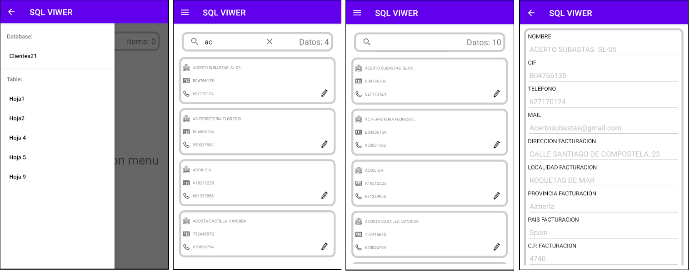
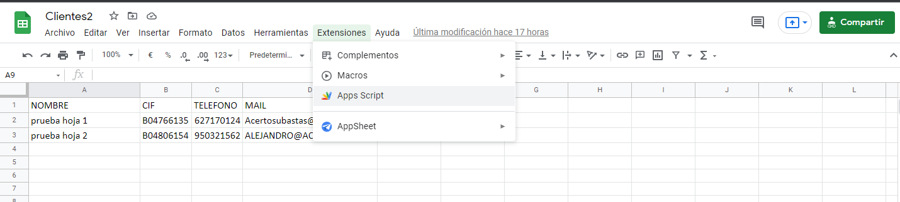
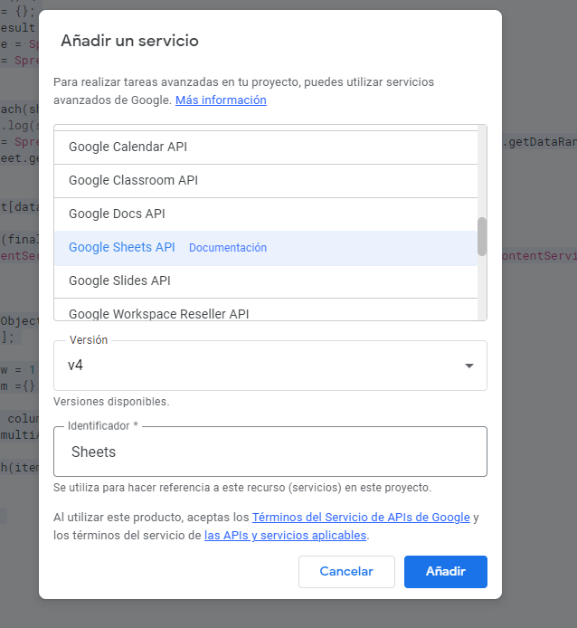
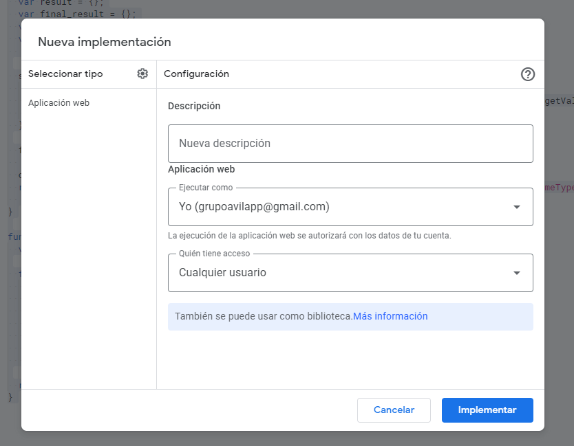

# Excell_api_app
App with Android where you can consult to a web excel.

* Vamos a conectar una app android con unos datos que se encuentran en una hoja de cálculo de google.
* Para ello necesitamos la extensión de la hoja de cálculo llamada AppsScript la cual recogerá los datos de esta y los transformará en un formato Json y mediante la url que genere podremos obtener los datos en nuestra app.

## Android App

* Una vez conectado todo y con acceso a la url recogeremos esos datos desde la aplicación y los convertiremos en un objeto para mayor comodidad.
* En la app solo podemos visualizar el contenido del excel en tiempo real todo lo que se modifique mediante un refresh se actualiza en la app.
* Esta app es escalable, no solo funciona presiamente con estos datos ni con estas hojas si no que teniendoe sta app solo tenemos que activar en otra empresa su excel en google y app script y los datos de esa empresa funcionarian iguamente en la app.



### Mejoras 

- [x] Actualización de datos en iempo real
- [x] Escalable para cualquer excell
- [ ] Mejor estilo
- [ ] CRUD
- [ ] Escalabilidad de la url de acceso a App Script


## AppScript
* Esto es una extensión dentro de googleSheets que debemos activar y enlazar con la hoja de calculo.



* Tambien debemos activar dentro de esta sección el servicio de Google Sheets API para poder conectar excel con este script.





* Con este código recogemos todas las hojas que hay en el excel y los datos dentro de cada uno y mediante GET con una url obtenemos un JSON con los datos.

```javaScript
function doGet() {
  var result = {};
  var final_result = {};
  var database = SpreadsheetApp.getActive().getName();
  var sheets = SpreadsheetApp.getActiveSpreadsheet().getSheets();
  

  sheets.forEach(sheet => {
    //console.log(sheet.getName());
    var hoja = SpreadsheetApp.getActiveSpreadsheet().getSheetByName(sheet.getName()).getDataRange().getValues();
    var rows = SpreadsheetApp.getActiveSpreadsheet().getSheetByName(sheet.getName()).getLastColumn();
    
    result[sheet.getName()] = makeObject(hoja, rows);
  });

  final_result[database] = result;
  
  //console.log(final_result);
  return ContentService.createTextOutput(JSON.stringify(final_result)).setMimeType(ContentService.MimeType.JSON)
  
}

function makeObject(multiArr, num_rows) {
  var obj = [];

  for (var row = 1; row < multiArr.length; row++) {
      var item ={};
      
      for(var column = 0; column < num_rows; column++){
        item[multiArr[0][column]] = multiArr[row][column]
      }
      obj.push(item);
    }

    //console.log(item)

  return obj;
}
```

* Una vez tengamos el código creado debemos implementarlo añadiendo un nombre a la implementación y dando permisos a todo el mundo.




